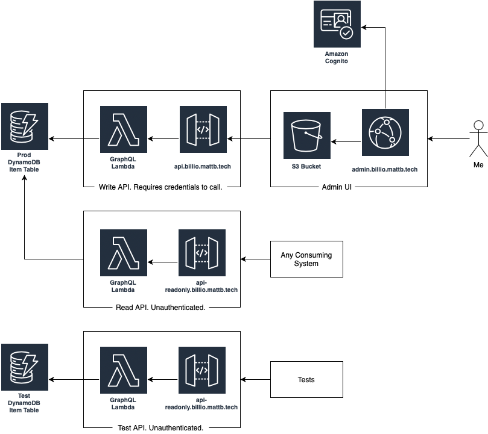

# Billio

My digital shelving unit showing what I'm reading and playing.

Billio came into existance when Goodreads announced the end of their existing API product. I'd been using Goodreads for a long time to track what I've been reading, but the API was essential to me. I don't want to trap my data inside a platform with limited ways to get it out. I started Billio with books in mind, but quickly decided to build it to cover video games, and potentially other things in the future too.

Billio allows you to store books or video games ("items") on particular "shelves" depending on whether you've finished them, given up on them, or are in the process of consuming them. Billio keeps track of when the items are moved between shelves, and some other basic metadata. Data for books comes from Google Books and for games comes from IGDB.


## Architecture

Billio has 3 main constituant parts. A Data Layer enabling the storage of items in DynamoDB, a GraphQL API enabling both queries and mutations and an Admin UI allowing you to add, remove and move items. Authentication is handled by Cognito, and everything runs inside AWS orchestrated by CDK.



Deplying this package creates three instances of the API.

The first is the read/write API used by the Admin UI. It requires calls to by signed with IAM credentials, which can be got from Cognito with a valid login. It supports both queries and mutations.

The second is a readonly API. This can be used by any downstream system that wants access to the data. This is unauthenticated for convenience (in this instance I consider what I'm reading and playing to be public data). At the moment I am schema stitching this API into the main GraphQL API I use to power my [personal website](https://lonesome.mattb.tech/).

The third is a test API. This supports both reading and writing, and for convenience is unauthenticated. It writes to a separate DynamoDB table that I use in development.

### Hardcodings

At the moment this isn't setup for anyone else to deploy. The following things are hard-coded:

- Usage of `billio.mattb.tech` domain
- Named `mattb.tech-deploy` AWS profile
- When runing locally the AWS resources required are hardcoded to my deployment
- All Cognito user pool details are hardcoded into the Admin UI

## Packages

### @mattb.tech/billio-cdk

The package containing the CDK definitions for billio. Deploys all the other components.

### @mattb.tech/billio-data

The package containing the data layer. Contains all the logic to query and mutate the data stored in DynamoDB. Handles all types as generic "items" with any type specific logic handled in the graphql layer.

### @mattb.tech/billio-graphql

The package containing the graphql layer. Deployed as a lambda function behind API Gateway by the CDK package.

### @mattb.tech/billio-admin

The package containing the admin UI. Deployed to an S3 bucket behind Cloudfront.

### @mattb.tech/billio-graphql-snapshot-tests

Package containing tests for the GraphQL layer that calls the GraphQL API.

### @mattb.tech/billio-backup

Package that exports the data from the data layer to flat files for backup. Could also be used for any data restructuring or migrations. CDK package deploys this as a lambda function that takes a backup on the first day of every month.

### @mattb.tech/billio-bulk-import

Package to enable bulk import of data from external sources. Currently handles books from goodreads and movies / TV series from IMDb.

## Operations

### Deployment

Deploy by running:

```sh
$ yarn deploy
```

### Development

#### GraphQL

```sh
$ yarn start:graphql
```

Set `INFRA_STACK=test` if you want to run locally using the test table rather than a dedicated local development table.

#### Admin

```sh
$ yarn start:admin
```

Set `REACT_APP_USE_LOCAL_GRAPHQL=1` if you want to run against the local graphql.

### Testing

The only tests in this project currently are in the `graphql-snapshot-tests` package.

To run against local instance (generally started with INRA_STACK=test):

```sh
$ yarn test:graphql-local
```

To run against the test API instance

```sh
$ yarn test:graphql-integration
```

### Alarms

The only alarm is monitoring that the monthly data backup happens successfully. Everything else is only exercised by using UIs, and as the only user I can notice if anything is going wrong manually.

### Creating a User

```sh
$ aws cognito-idp admin-create-user --user-pool-id us-east-1_nIN7ZeVpN --username $USERNAME --profile mattb.tech-deploy
$ aws cognito-idp admin-set-user-password --user-pool-id us-east-1_nIN7ZeVpN --username $USERNAME --password $PASSWORD --permanent --profile mattb.tech-deploy
```
